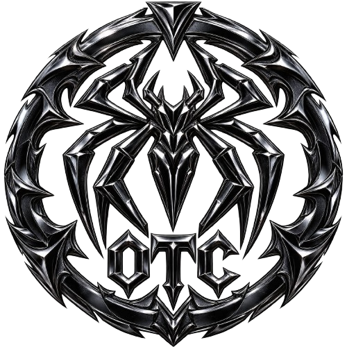

# OTC Hub v1

<p align="center"></p>

<h1 align="center">OTC Hub v1</h1>
<p align="center">Modern, modular and customizable Roblox Luau UI Library.</p>
<p align="center"><b>Version 1.0.3</b> • <b>by Aerlro</b></p>

---

## ✨ 1.0.3

- 🎨 Modern floating window redesign
- 🔎 Global UI search
- 💾 Multi-config management
- 📤 Config export / import
- 🗑️ Config delete / list
- 📱 Improved responsive scaling
- 🧩 Paragraph, Badge, Progress and Image elements
- 🎨 Per-window theme isolation
- 🛠️ Custom theme registration fixes
- 📜 Structured version changelog
- 🔒 Roman Reigns theme remains owner-only and is not public
- ⚡ Version-specific loader
- 🚀 Latest loader

---

## 📥 Load Latest

The latest loader always follows the `main` version of OTC Hub.

```lua
loadstring(game:HttpGet("https://raw.githubusercontent.com/Aerlro/OTC-Hub-v1/main/latest.lua"))()
```

Direct latest library:

```lua
loadstring(game:HttpGet("https://raw.githubusercontent.com/Aerlro/OTC-Hub-v1/main/otc.lua"))()
```

## 📌 Load a Specific Version

OTC keeps versioned source trees so a version can stay fixed instead of following `main`.

### v1.0.3

```lua
loadstring(game:HttpGet("https://raw.githubusercontent.com/Aerlro/OTC-Hub-v1/main/v1.0.3.lua"))()
```

Direct version source:

```lua
loadstring(game:HttpGet("https://raw.githubusercontent.com/Aerlro/OTC-Hub-v1/main/versions/1.0.3/otc.lua"))()
```

This means `latest` can continue receiving fixes while a script can stay on an exact version.

---

## 🪟 Window

```lua
local OTC = loadstring(game:HttpGet("https://raw.githubusercontent.com/Aerlro/OTC-Hub-v1/main/latest.lua"))()

local Window = OTC:CreateWindow({
    Name = "OTC Hub",
    Subtitle = "by Aerlro",
    Theme = "Cyber",
    Width = 640,
    Height = 420,
    ToggleKey = Enum.KeyCode.RightControl,
    Responsive = true
})
```

The 1.0.3 window uses a floating dashboard layout with rounded surfaces, an accent rail, separated navigation, user card, modern controls and responsive scaling.

### Window API

```lua
Window:Toggle()
Window:Minimize()
Window:Restore()
Window:Search("Walkspeed")
Window:SaveConfig()
Window:LoadConfig()
Window:DeleteConfig("MyConfig")
```

---

## 🔎 Search

Click the search button in the top bar or use:

```lua
Window:Search("Walkspeed")
```

The search system can locate tabs and registered elements and switch to the matching tab.

---

## 📑 Tabs

```lua
local MainTab = Window:CreateTab({
    Name = "Main",
    Icon = "home"
})
```

---

## 🧩 Elements

### Button

```lua
MainTab:CreateButton({
    Name = "Test Button",
    Description = "Test the button.",
    Callback = function()
        print("Clicked")
    end
})
```

### Toggle

```lua
MainTab:CreateToggle({
    Name = "Infinite Jump",
    CurrentValue = false,
    Flag = "InfiniteJump",
    Callback = function(Value)
        print(Value)
    end
})
```

### Slider

```lua
MainTab:CreateSlider({
    Name = "Walkspeed",
    Range = {16, 250},
    Increment = 1,
    CurrentValue = 16,
    Flag = "Walkspeed",
    Callback = function(Value)
        print(Value)
    end
})
```

### Dropdown

```lua
MainTab:CreateDropdown({
    Name = "Player",
    Options = {"Player 1", "Player 2", "Player 3"},
    CurrentOption = "Player 1",
    Callback = function(Value)
        print(Value)
    end
})
```

### Multi-select Dropdown

```lua
MainTab:CreateDropdown({
    Name = "Features",
    Options = {"ESP", "Auto Farm", "Auto Sell"},
    CurrentOption = {},
    MultiSelect = true,
    Callback = function(Value)
        print(Value)
    end
})
```

### Input

```lua
MainTab:CreateInput({
    Name = "Username",
    PlaceholderText = "Enter username...",
    Flag = "Username",
    Callback = function(Value)
        print(Value)
    end
})
```

### Keybind

```lua
MainTab:CreateKeybind({
    Name = "Toggle Menu",
    Default = Enum.KeyCode.RightControl,
    Flag = "ToggleMenuKey",
    Callback = function(Key)
        print(Key.Name)
    end
})
```

### Colorpicker

```lua
MainTab:CreateColorpicker({
    Name = "Accent Color",
    Default = Color3.fromRGB(0, 225, 255),
    Flag = "AccentColor",
    Callback = function(Color)
        print(Color)
    end
})
```

### Stat

```lua
local FPS = MainTab:CreateStat({
    Name = "FPS",
    Value = "60"
})

FPS:SetValue("144")
```

### Paragraph

```lua
MainTab:CreateParagraph({
    Title = "Information",
    Content = "This is a larger information block for your hub."
})
```

### Badge

```lua
MainTab:CreateBadge({
    Text = "PREMIUM"
})
```

### Progress

```lua
local Progress = MainTab:CreateProgress({
    Name = "Loading",
    Value = 75,
    Max = 100
})

Progress:SetValue(100)
```

### Image

```lua
MainTab:CreateImage({
    Image = "rbxassetid://1234567890"
})
```

### Divider / Space / Text

```lua
MainTab:CreateDivider()
MainTab:CreateSpace(12)
MainTab:CreateText("Welcome to OTC Hub!")
```

---

## 💾 Configuration 2.0

Flagged elements are stored automatically in JSON configurations.

```lua
local Window = OTC:CreateWindow({
    Name = "My Script",
    Theme = "Cyber",
    Configuration = {
        AutoSave = true,
        AutoLoad = true,
        FileName = "MyScript"
    }
})
```

### Config API

```lua
Window:SaveConfig("Main")
Window:LoadConfig("Main")
Window:DeleteConfig("Main")

local Configs = Window:GetConfigs()
local Data = Window:ExportConfig("Main")
Window:ImportConfig("Imported", Data)
```

The underlying configuration module also exposes `Exists`, `Delete`, `List`, `Export` and `Import`.

---

## 🔔 Notifications

```lua
OTC:Notify({
    Title = "OTC Hub",
    Content = "Successfully loaded!",
    Duration = 4
})
```

Notifications use the active window's theme rather than the global default theme.

---

## 🪟 Dialog

```lua
Window:Dialog({
    Title = "OTC Hub",
    Content = "Continue?",
    Buttons = {
        {Name = "Cancel"},
        {
            Name = "Continue",
            Primary = true,
            Callback = function()
                print("Confirmed")
            end
        }
    }
})
```

---

## 🎨 Themes

Built-in public themes:

```text
Default
Red
Green
Blue
Purple
Orange
Cyber
Halloween
```

The **Roman Reigns** theme is intentionally private and restricted to the owner account. It is not a public theme.

### Change theme

```lua
Window:SetTheme("Cyber")
OTC:SetTheme("Halloween")
```

`Window:SetTheme()` changes only that window. `OTC:SetTheme()` changes the library's active theme and applies it to all active windows.

### Custom theme

```lua
OTC:RegisterTheme("Custom", {
    Background = Color3.fromRGB(10, 10, 20),
    Secondary = Color3.fromRGB(15, 15, 30),
    Element = Color3.fromRGB(25, 25, 45),
    Accent = Color3.fromRGB(255, 0, 170),
    Text = Color3.fromRGB(255, 255, 255),
    SubText = Color3.fromRGB(190, 190, 210)
})

Window:SetTheme("Custom")
```

Custom themes inherit missing properties from `Default`.

---

## 🚩 Flags

```lua
OTC:SetFlag("AutoFarm", true)

local Enabled = OTC:GetFlag("AutoFarm", false)
```

---

## 🎬 Tween

```lua
OTC:Tween(Object, 0.25, {
    BackgroundTransparency = 0
})
```

---

## 📜 Version Changelog

The version popup now separates changes into:

```text
[ADDED]
[FIXED]
[CHANGED]
[REMOVED]
```

Click the version badge in the window header to view the current release changelog.

---

## 📁 Project Structure

```text
OTC-Hub-v1/
├── otc.lua
├── latest.lua
├── v1.0.3.lua
├── loader.lua
├── OTC.png
├── Owner/
├── Core/
│   ├── tab.lua
│   ├── window.lua
│   ├── theme.lua
│   ├── animation.lua
│   ├── notification.lua
│   ├── loading.lua
│   ├── lucide.lua
│   ├── config.lua
│   └── dialog.lua
├── Elements/
│   ├── button.lua
│   ├── toggle.lua
│   ├── slider.lua
│   ├── dropdown.lua
│   ├── input.lua
│   ├── keybind.lua
│   ├── colorpicker.lua
│   ├── stat.lua
│   ├── paragraph.lua
│   ├── badge.lua
│   ├── progress.lua
│   └── image.lua
└── versions/
    └── 1.0.3/
        ├── otc.lua
        ├── Core/
        └── Elements/
```

---

## 👤 Author

**Aerlro**

OTC Hub v1 is developed by Aerlro.

---

## 📜 License

This project is provided for educational and development purposes.

Do not claim the project as your own.
